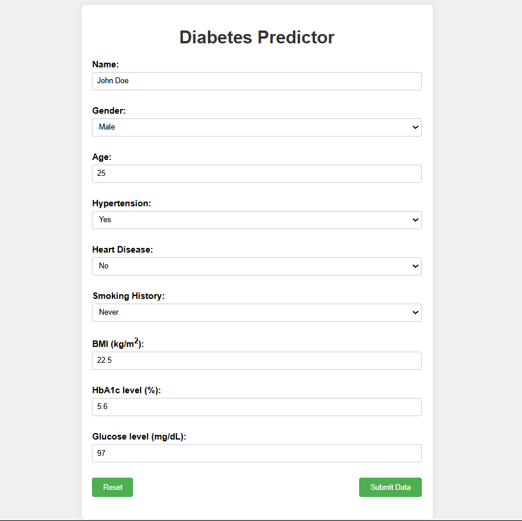
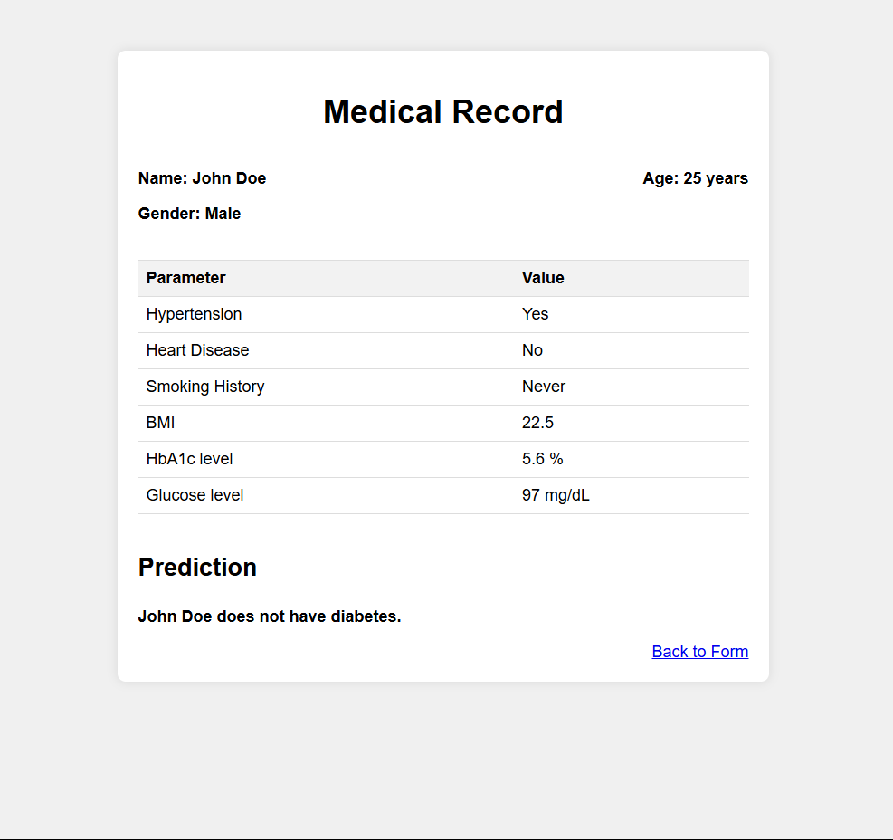

# Diabetes Predictor
The Diabetes Predictor leverages machine learning algorithms like SVM, Random Forest, KNN, and XGBoost to predict the likelihood of diabetes based on health metrics. This tool is designed to assist healthcare professionals and individuals in making early and informed health decisions.

## Project Structure
The project consists of the following pretrained models:
- `Diabetes_model_all.pkl`
- `Diabetes_model_knn.pkl`
- `Diabetes_model_randomforest.pkl`
- `Diabetes_model_xgbclassifier.pkl`

**Note**: Due to size constraints, two models - `Diabetes_model_all` and `Diabetes_model_randomforest` are not included in the repository. 
 
**To view all models and project files, please visit the following link:** https://drive.google.com/drive/folders/1DaL7hMjSVc65gZu5QrWFPrFI2EljEdJ2?usp=drive_link

## Features
1. Multiple Machine Learning Models: Leverages various models for accurate prediction.
2. User-Friendly Interface: Easy to integrate and use with minimal setup.
3. Modular Design: Flexibility to add or modify models as per the user’s needs.

## Results
The models have shown promising results on real-world datasets, **achieving high accuracy of 95%** in predicting diabetes risk based on health data provided by the user.

## Key Insights

